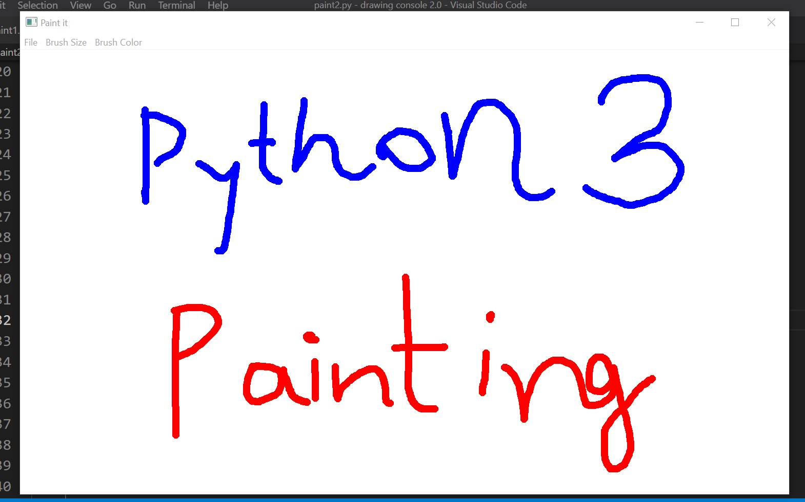

# Drawing Console 2.0
* ## to run the app , install the library
    > pip install PyQt5
* ### now open the terminal in working directory where app file is present
* ### run the app and enjoy painting.
## Demo of the app
